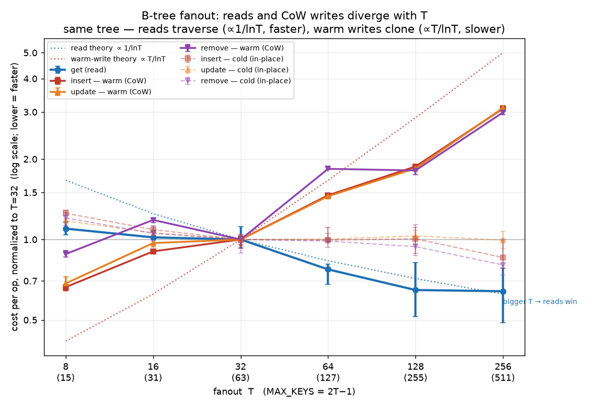

# B-tree fanout (`T`) sweep — bench-host results (2026-07-09)

Authoritative AWS-NVMe results behind the `T = 32 → 64` default bump (task50 §fanout,
`docs/superpowers/specs/2026-07-08-btree-optimization-candidates.md` §2). Preserved here because
`bench-infra/bench-out/` is gitignored — the summary tables live in the task docs, but the raw
per-run data (below) would otherwise be lost.

**Host (all runs):** AWS local-NVMe, 8 vcpu, 15701 MB, kernel `6.17.0-1019-aws`. Provisioned +
torn down per run via `bench-infra` (`make bench-oneshot`-style, guaranteed teardown).

---

## ⭐ The core finding: fanout `T` pulls reads and writes in *opposite* directions

**This is the single most important result from all the fanout testing. Bigger `T` makes reads
faster and CoW writes slower — on the *same tree* — because reads only *traverse* nodes while writes
*clone* them.** Any future re-tuning of `T` (or a decision to make it configurable) must weigh both
sides; you cannot optimize `T` for one without paying on the other.

| | What `T` controls | Effect of **bigger** `T` | Net |
|---|---|---|---|
| **Read** (`get`, p99-under-load) | tree **height** ≈ `ln N / ln T` — nodes *traversed & binary-searched*, never copied | shallower tree → fewer cache-missing hops | **faster** ✅ (T=64 read p99 **−62%**) |
| **CoW write** (SMR-apply update on a warm/shared tree) | **width** of each node cloned by `Arc::make_mut` on the root→leaf path, O(`T`) per node | total copy ≈ height × width ≈ `T / ln T` — *increasing* in `T` for T>e | **slower** ❌ (T=64 apply **−22%**) |

**Why writes lose despite the shallower tree:** a CoW write must `Arc::make_mut`-clone every node on
its path that is still shared with a retained snapshot, and each clone deep-copies that node's full
`entries`/`children` `Vec` (width O(`T`)). Fewer levels (`1/ln T`) but each level twice as wide
(`∝ T`) nets out to `T / ln T` copy work — e.g. `32/ln32 ≈ 9.2` → `64/ln64 ≈ 15.4`, ~**1.7× more
copy per update** at T=64. Reads pay none of this: they clone nothing, so they only see the height
win. (Details + code anchors in §3.)

> **Corollary — the write penalty is an MVCC-sharing tax, not intrinsic to `T`.** It exists *only*
> because `make_mut` finds nodes shared with live snapshots (warm store, ~10 retained). On a cold
> store with uniquely-owned nodes, `make_mut` mutates in place, the O(`T`) clones vanish, and bigger
> `T` would help writes too (shallower descent). The read/write split is a property of copy-on-write
> under retained readers, not of B-trees in general.

### 📈 Direct measurement (T = 8…256) — the asymmetry, plotted and formula-checked

Run `20260709T153011Z` (git `95a878a`, rustc 1.97.0, same host), `examples/fanout_microbench`
(`make bench/fanout-micro`), 7 runs/arm, 1M-key tree, per-op cost. Each write op is measured in
**both** regimes — *warm* (op on a snapshot-shared tree → `make_mut` clones the path) and *cold*
(op on a uniquely-owned tree → in-place, no clone). `get` never clones. This isolates the asymmetry
directly rather than inferring it from the SMR metric.



Median ns/op, normalized to T=32 (lower = faster):

| T | MAX_KEYS | get (read) | insert·warm | update·warm | remove·warm | insert·cold | update·cold | remove·cold |
|--:|--:|--:|--:|--:|--:|--:|--:|--:|
| 8 | 15 | 1.10 | 0.66 | 0.68 | 0.88 | 1.25 | 1.17 | 1.21 |
| 16 | 31 | 1.02 | 0.90 | 0.97 | 1.18 | 1.09 | 1.06 | 1.05 |
| **32** | **63** | **1.00** | **1.00** | **1.00** | **1.00** | **1.00** | **1.00** | **1.00** |
| 64 | 127 | 0.77 | 1.46 | 1.45 | 1.84 | 1.00 | 1.00 | 0.99 |
| 128 | 255 | 0.65 | 1.88 | 1.85 | 1.81 | 1.01 | 1.03 | 0.94 |
| 256 | 511 | **0.64** | **3.09** | **3.11** | **2.99** | 0.86 | 0.99 | 0.80 |

Absolute @T=32 (ns/op): get 404, insert·warm 7090, update·warm 4880, remove·warm 5157, insert·cold
756, update·cold 622, remove·cold 720.

**The three curves behave exactly as the formulas predict:**

- **Reads track `1/ln T`** — monotonically faster with `T` (1.10 → 0.64). Fit is tight for T≥64
  (Δ vs theory −7% / −9% / +2%); at T=8/16 the measured curve is *flatter* than `1/ln T` (−34% /
  −19%) because a fixed per-`get` floor (loop + tiny cache-resident node traversal) dilutes the
  height term when nodes are small.
- **Warm writes track `T/ln T`** — monotonically *slower* with `T` (0.74 → 3.06, avg of the three).
  Right shape, tight at T=64 (−5%); at T=128/256 the measured ratio grows *less* steeply than the
  pure asymptote (−35% / −39%) because warm cost = clone term (`∝ T/ln T`) **plus** a `T`-independent
  floor (descent, per-node `malloc`, the leaf edit) that damps the ratio. The *direction and
  super-linear divergence from reads* — the whole point — are unambiguous.
- **Cold writes are FLAT** (1.21 → 0.88, no upward trend) — completely decoupled from `T/ln T`. This
  is the corollary, measured: with no sharing there is no clone, so `T` barely moves in-place writes.

**The clincher — same operation, opposite sign, set only by sharing:** at T=256, **`insert` is 3.09×
slower warm but 0.86× (faster) cold** vs T=32. And the costs that scale:

- **Clone tax** (warm ÷ cold insert): **9.4× at T=32 → 34× at T=256** — the CoW penalty itself grows with `T`.
- **Read↔warm-write gap** (warm insert ÷ get): **17× at T=32 → 85× at T=256** — reads and writes pull apart as `T` climbs.

So `T` is genuinely a two-sided knob: every step up buys read/height and sells write/clone-width.
Full fit tables + raw per-run data: §4 below. Reproduce: `make bench/fanout-micro` then
`scripts/plot_fanout_asymmetry.py <log> out.png`.

---

## TL;DR

- **Uncontended bulk ops (1M random keys):** larger `T` wins monotonically up to ~64. **T=64**
  is the balance point — get −18–28%, insert ~−8%, remove ~−6–19% vs T=32; T=128 helps writes a
  hair more but regresses reads.
- **Contended SMR-apply + read-under-load:** "apply" here is the **SMR apply path**
  (`Persistence::smr` — replaying *already-committed* batches from the consensus log into the CoW
  tree, not an interactive `WriteTx::commit`). **T=64 costs −22% apply throughput** (bigger nodes →
  bigger `Arc::make_mut` memmove/CoW per applied batch) but gives **−62% read p99** (shallower tree
  → consistent low tail). Both effects are tight and reproducible (15 runs/arm, non-overlapping).
- **T=48 is dominated:** ~full apply hit (−19%), *bimodal* p99 (median no better than T=32), only
  ~half the bulk get win. No useful middle ground — the metrics are non-monotonic in `T`.
- **Decision: keep `T=64`.** −22% SMR-apply accepted for the broad read/bulk/p99 wins.

---

## 1. Bulk fanout — full sweep `T ∈ {8,16,32,64,128}`, 1M random keys

Post in-place rebalancing (task50 §5.1). Times normalized to T=32, **lower = faster**.
Run `20260709T065146Z`, git `906e5a4`, rustc 1.96.1.

| T | MAX_KEYS | get | insert | remove |
|--:|--:|--:|--:|--:|
| 8 | 15 | 1.73 | 1.27 | 1.24 |
| 16 | 31 | 1.26 | 1.07 | 1.00 |
| **32** | **63** | **1.00** | **1.00** | **1.00** |
| 64 | 127 | 0.82 | 0.92 | 0.81 |
| 128 | 255 | 0.96 | 0.88 | 0.80 |

Absolute @T=32: get 213.0 ms, insert 512.5 ms, remove 450.4 ms.

## 2. Bulk fanout — `T ∈ {32,48,64}` (the T=48 point)

Separate run (`20260709T092723Z`, git `05b19ea`) — its T=64 numbers differ from §1 by run-to-run
noise (get 0.72 vs 0.82), so **T=48 must be read against *this* run's T=32/64, not spliced into §1.**

| T | MAX_KEYS | get | insert | remove |
|--:|--:|--:|--:|--:|
| **32** | **63** | **1.00** | **1.00** | **1.00** |
| 48 | 95 | 0.83 | 0.95 | 0.99 |
| 64 | 127 | 0.72 | 0.94 | 0.94 |

Absolute @T=32: get 179.0 ms, insert 411.4 ms, remove 333.3 ms. T=48 keeps ~half the get win and
essentially none of the insert/remove win.

## 3. SMR-apply + read-p99-under-load — `T ∈ {32,48,64}`, 15 runs/arm (authoritative)

Run `20260709T130609Z`, git `07cf6ba`, rustc 1.97.0. `median [min-max]`, ratio ×T32.
`apply_sw_batch_throughput` higher = better; `read_p99_under_load_ns` lower = better.

> **Where the fanout cost actually lands: the row update, not the commit.** Each timed txn is
> `begin_write → open_table → update → commit` (`smr_bench.rs` block (c)). The `T`-dependent cost is
> entirely in `tbl.update` → `BTree::insert_mut` (`table.rs:317`), which `Arc::make_mut`-copies every
> node on the root→leaf path still shared with the live snapshot — bigger `T` = bigger node `Vec` =
> bigger memmove per copied node. `commit_single_writer` (`store.rs:2638`) is a *fixed* cost
> independent of `T`: it Arc-clones the table map, wraps the already-built dirty tree, and inserts a
> snapshot — it never touches a B-tree node. And because this is SMR mode (no `wal_handle`), commit
> does **no fsync/parking**. So "apply throughput" here is the CoW path-copy rate, **not** a commit
> rate — which is exactly why fanout moves it.

| T | MAX_KEYS | apply throughput | read p99 (ns) |
|--:|--:|--:|--:|
| **32** | 63 | 346014 [343330–347444] · 1.00× | 2287 [2194–2367] · 1.00× |
| 48 | 95 | 280970 [279803–281393] · 0.81× | 2325 [993–2445] · 1.02× |
| 64 | 127 | 270670 [267266–271300] · 0.78× | 859 [715–958] · 0.38× |

**apply throughput** arms are razor-tight and non-overlapping → the −19%/−22% regression is real.
**read p99**: T=32 and T=48 overlap (T=48 is *bimodal* — see raw runs below: four ~1000 ns runs,
eleven ~2300 ns); only **T=64 is a clean, separated −62%**. The earlier "T=48 worse than both"
reading was p99 noise — the ranges show it's not.

> Note: a *sandbox* SMR-ab run showed T=64 p99 *worse* (+41%) — a VM-contention artifact. The
> bench host (dedicated NVMe) is authoritative and shows the opposite: T=64 p99 much better.

---

## Raw logs (verbatim, as fetched from the bench host)

### 3a. `smr-ab.log` — 15 runs/arm SMR-apply (run `20260709T130609Z`, git `07cf6ba`, rustc 1.97.0)

```
scripts/smr_apply_ab.sh
>>> building + benching T=32 (MAX_KEYS=63), 15 runs...
>>> building + benching T=48 (MAX_KEYS=95), 15 runs...
>>> building + benching T=64 (MAX_KEYS=127), 15 runs...

# SMR-apply A/B — 15 runs/arm, median [min-max], normalized to T=32

| T | MAX_KEYS | apply_sw_batch_throughput (higher=better) | read_p99_under_load_ns (lower=better) |
|--:|--:|--:|--:|
| **32** | 63 | 346014 [343330-347444]  1.00x | 2287 [2194-2367]  1.00x |
| 48 | 95 | 280970 [279803-281393]  0.81x | 2325 [993-2445]  1.02x |
| 64 | 127 | 270670 [267266-271300]  0.78x | 859 [715-958]  0.38x |

raw apply_sw_batch_throughput per run (sorted):
  T=32: 343330 344581 345223 345229 345491 345680 345759 346014 346022 346032 346101 346254 346745 347195 347444
  T=48: 279803 280104 280208 280463 280784 280838 280891 280970 281056 281065 281136 281148 281266 281320 281393
  T=64: 267266 269600 269875 269977 270419 270453 270509 270670 270733 270757 270899 270981 271177 271290 271300
raw read_p99_under_load_ns per run (sorted):
  T=32: 2194 2229 2237 2257 2278 2284 2285 2287 2319 2324 2329 2331 2354 2363 2367
  T=48: 993 998 1069 1130 2028 2081 2139 2325 2333 2362 2380 2391 2411 2426 2445
  T=64: 715 780 814 818 828 834 835 859 863 866 870 896 914 953 958
```

### 1a. `fanout.log` — full 8–128 sweep (run `20260709T065146Z`, git `906e5a4`, rustc 1.96.1)

```
scripts/fanout_ab.sh
>>> building + benching T=8 (MAX_KEYS=15)...
>>> building + benching T=16 (MAX_KEYS=31)...
>>> building + benching T=32 (MAX_KEYS=63)...
>>> building + benching T=64 (MAX_KEYS=127)...
>>> building + benching T=128 (MAX_KEYS=255)...

# fanout A/B @ 1,000,000 random keys — normalized to T=32 (lower=faster)

| T | MAX_KEYS | get | insert | remove |
|--:|--:|--:|--:|--:|
| 8 | 15 | 1.73 | 1.27 | 1.24 |
| 16 | 31 | 1.26 | 1.07 | 1.00 |
| **32** | 63 | 1.00 | 1.00 | 1.00 |
| 64 | 127 | 0.82 | 0.92 | 0.81 |
| 128 | 255 | 0.96 | 0.88 | 0.80 |

absolute @T=32: get 213.0 ms, insert 512.5 ms, remove 450.4 ms
```

### 2a. `fanout.log` — 32/48/64 sweep (run `20260709T092723Z`, git `05b19ea`, rustc 1.96.1)

```
scripts/fanout_ab.sh
>>> building + benching T=32 (MAX_KEYS=63)...
>>> building + benching T=48 (MAX_KEYS=95)...
>>> building + benching T=64 (MAX_KEYS=127)...

# fanout A/B @ 1,000,000 random keys — normalized to T=32 (lower=faster)

| T | MAX_KEYS | get | insert | remove |
|--:|--:|--:|--:|--:|
| **32** | 63 | 1.00 | 1.00 | 1.00 |
| 48 | 95 | 0.83 | 0.95 | 0.99 |
| 64 | 127 | 0.72 | 0.94 | 0.94 |

absolute @T=32: get 179.0 ms, insert 411.4 ms, remove 333.3 ms
```

## 4. Read-vs-write asymmetry — fit tables + raw run data

Fit of measured medians to the formulas (normalized to T=32; Δ% = measured vs theory):

**Reads vs `1/ln T`**

| T | get measured | 1/lnT theory | Δ% |
|--:|--:|--:|--:|
| 8 | 1.10 | 1.67 | −34% |
| 16 | 1.02 | 1.25 | −19% |
| 32 | 1.00 | 1.00 | 0% |
| 64 | 0.77 | 0.83 | −7% |
| 128 | 0.65 | 0.71 | −9% |
| 256 | 0.64 | 0.62 | +2% |

**Warm (CoW) writes vs `T/ln T`** (avg of insert/update/remove)

| T | warm measured | T/lnT theory | Δ% |
|--:|--:|--:|--:|
| 8 | 0.74 | 0.42 | +78% |
| 16 | 1.02 | 0.62 | +63% |
| 32 | 1.00 | 1.00 | 0% |
| 64 | 1.58 | 1.67 | −5% |
| 128 | 1.84 | 2.86 | −35% |
| 256 | 3.06 | 5.00 | −39% |

Both deviations have the same cause — a `T`-independent fixed cost per op (per-`get` traversal
overhead for reads; descent + `malloc` + leaf edit for warm writes) — which flattens the measured
ratio relative to the pure power law: it *raises* the small-T end and *lowers* the large-T end.
The monotonic directions (reads down, warm writes up) and their divergence are exactly as predicted.
Cold-write medians (1.21→0.88, no trend) do not track `T/ln T` at all — the corollary.

### 4a. `fanout-micro.log` — verbatim (run `20260709T153011Z`, git `95a878a`, rustc 1.97.0, 7 runs/arm)

```
scripts/fanout_micro_ab.sh
>>> building + benching T=8 (MAX_KEYS=15), 7 runs...
{"t":8,"n":1000000,"m":30000,"get_ns":434.4,"insert_warm_ns":4774.3,"update_warm_ns":3444.4,"remove_warm_ns":4591.6,"insert_cold_ns":972.3,"update_cold_ns":739.6,"remove_cold_ns":909.9}
{"t":8,"n":1000000,"m":30000,"get_ns":469.5,"insert_warm_ns":4787.8,"update_warm_ns":3542.6,"remove_warm_ns":4590.7,"insert_cold_ns":970.7,"update_cold_ns":724.4,"remove_cold_ns":908.9}
{"t":8,"n":1000000,"m":30000,"get_ns":419.6,"insert_warm_ns":4550.9,"update_warm_ns":3319.6,"remove_warm_ns":4692.3,"insert_cold_ns":948.0,"update_cold_ns":733.1,"remove_cold_ns":853.8}
{"t":8,"n":1000000,"m":30000,"get_ns":443.2,"insert_warm_ns":4701.1,"update_warm_ns":3293.6,"remove_warm_ns":4431.1,"insert_cold_ns":873.1,"update_cold_ns":681.8,"remove_cold_ns":846.2}
{"t":8,"n":1000000,"m":30000,"get_ns":469.1,"insert_warm_ns":4704.0,"update_warm_ns":3338.7,"remove_warm_ns":4456.6,"insert_cold_ns":950.1,"update_cold_ns":730.0,"remove_cold_ns":896.6}
{"t":8,"n":1000000,"m":30000,"get_ns":456.6,"insert_warm_ns":4709.2,"update_warm_ns":3399.4,"remove_warm_ns":4551.2,"insert_cold_ns":940.6,"update_cold_ns":736.1,"remove_cold_ns":868.2}
{"t":8,"n":1000000,"m":30000,"get_ns":434.1,"insert_warm_ns":4655.0,"update_warm_ns":3341.1,"remove_warm_ns":4460.2,"insert_cold_ns":850.7,"update_cold_ns":669.7,"remove_cold_ns":793.4}
>>> building + benching T=16 (MAX_KEYS=31), 7 runs...
{"t":16,"n":1000000,"m":30000,"get_ns":421.7,"insert_warm_ns":6400.6,"update_warm_ns":4569.4,"remove_warm_ns":5953.3,"insert_cold_ns":849.9,"update_cold_ns":661.5,"remove_cold_ns":807.8}
{"t":16,"n":1000000,"m":30000,"get_ns":434.8,"insert_warm_ns":6382.6,"update_warm_ns":4645.5,"remove_warm_ns":6193.7,"insert_cold_ns":805.2,"update_cold_ns":635.7,"remove_cold_ns":759.6}
{"t":16,"n":1000000,"m":30000,"get_ns":405.3,"insert_warm_ns":6405.2,"update_warm_ns":4624.0,"remove_warm_ns":6226.7,"insert_cold_ns":836.6,"update_cold_ns":671.3,"remove_cold_ns":763.8}
{"t":16,"n":1000000,"m":30000,"get_ns":411.0,"insert_warm_ns":6397.6,"update_warm_ns":4755.4,"remove_warm_ns":6188.2,"insert_cold_ns":794.4,"update_cold_ns":638.6,"remove_cold_ns":748.7}
{"t":16,"n":1000000,"m":30000,"get_ns":415.5,"insert_warm_ns":6508.1,"update_warm_ns":4877.4,"remove_warm_ns":6049.7,"insert_cold_ns":822.4,"update_cold_ns":662.1,"remove_cold_ns":745.7}
{"t":16,"n":1000000,"m":30000,"get_ns":404.5,"insert_warm_ns":6496.0,"update_warm_ns":4778.1,"remove_warm_ns":6076.0,"insert_cold_ns":834.5,"update_cold_ns":659.1,"remove_cold_ns":802.3}
{"t":16,"n":1000000,"m":30000,"get_ns":390.1,"insert_warm_ns":6316.3,"update_warm_ns":4732.8,"remove_warm_ns":6105.2,"insert_cold_ns":759.5,"update_cold_ns":618.7,"remove_cold_ns":711.7}
>>> building + benching T=32 (MAX_KEYS=63), 7 runs...
{"t":32,"n":1000000,"m":30000,"get_ns":412.3,"insert_warm_ns":7277.9,"update_warm_ns":4858.1,"remove_warm_ns":5132.7,"insert_cold_ns":769.8,"update_cold_ns":622.9,"remove_cold_ns":724.1}
{"t":32,"n":1000000,"m":30000,"get_ns":374.9,"insert_warm_ns":6760.7,"update_warm_ns":4778.7,"remove_warm_ns":5157.4,"insert_cold_ns":755.5,"update_cold_ns":598.0,"remove_cold_ns":746.0}
{"t":32,"n":1000000,"m":30000,"get_ns":400.6,"insert_warm_ns":7089.4,"update_warm_ns":5061.8,"remove_warm_ns":5186.8,"insert_cold_ns":770.1,"update_cold_ns":621.7,"remove_cold_ns":720.4}
{"t":32,"n":1000000,"m":30000,"get_ns":450.7,"insert_warm_ns":7100.0,"update_warm_ns":4807.7,"remove_warm_ns":5022.7,"insert_cold_ns":698.4,"update_cold_ns":585.7,"remove_cold_ns":642.7}
{"t":32,"n":1000000,"m":30000,"get_ns":420.3,"insert_warm_ns":7089.7,"update_warm_ns":4940.8,"remove_warm_ns":5227.7,"insert_cold_ns":789.3,"update_cold_ns":633.5,"remove_cold_ns":747.3}
{"t":32,"n":1000000,"m":30000,"get_ns":403.5,"insert_warm_ns":7337.9,"update_warm_ns":5029.1,"remove_warm_ns":5294.0,"insert_cold_ns":752.7,"update_cold_ns":623.2,"remove_cold_ns":716.1}
{"t":32,"n":1000000,"m":30000,"get_ns":398.2,"insert_warm_ns":7021.0,"update_warm_ns":4880.0,"remove_warm_ns":5153.5,"insert_cold_ns":742.2,"update_cold_ns":615.2,"remove_cold_ns":683.1}
>>> building + benching T=64 (MAX_KEYS=127), 7 runs...
{"t":64,"n":1000000,"m":30000,"get_ns":294.1,"insert_warm_ns":10240.5,"update_warm_ns":7047.5,"remove_warm_ns":9419.5,"insert_cold_ns":739.1,"update_cold_ns":602.2,"remove_cold_ns":710.9}
{"t":64,"n":1000000,"m":30000,"get_ns":321.6,"insert_warm_ns":10251.9,"update_warm_ns":7011.7,"remove_warm_ns":9416.1,"insert_cold_ns":782.6,"update_cold_ns":624.6,"remove_cold_ns":736.8}
{"t":64,"n":1000000,"m":30000,"get_ns":311.9,"insert_warm_ns":10427.7,"update_warm_ns":7137.1,"remove_warm_ns":9559.6,"insert_cold_ns":750.7,"update_cold_ns":627.1,"remove_cold_ns":683.7}
{"t":64,"n":1000000,"m":30000,"get_ns":326.8,"insert_warm_ns":10408.8,"update_warm_ns":7186.2,"remove_warm_ns":9690.5,"insert_cold_ns":751.8,"update_cold_ns":604.4,"remove_cold_ns":716.6}
{"t":64,"n":1000000,"m":30000,"get_ns":297.4,"insert_warm_ns":10380.2,"update_warm_ns":7083.3,"remove_warm_ns":9482.8,"insert_cold_ns":797.0,"update_cold_ns":688.4,"remove_cold_ns":799.1}
{"t":64,"n":1000000,"m":30000,"get_ns":318.6,"insert_warm_ns":10393.3,"update_warm_ns":7084.8,"remove_warm_ns":9496.6,"insert_cold_ns":754.8,"update_cold_ns":607.9,"remove_cold_ns":703.8}
{"t":64,"n":1000000,"m":30000,"get_ns":274.6,"insert_warm_ns":10380.5,"update_warm_ns":7204.9,"remove_warm_ns":9416.3,"insert_cold_ns":740.3,"update_cold_ns":632.2,"remove_cold_ns":673.6}
>>> building + benching T=128 (MAX_KEYS=255), 7 runs...
{"t":128,"n":1000000,"m":30000,"get_ns":267.0,"insert_warm_ns":13381.1,"update_warm_ns":9021.8,"remove_warm_ns":9351.0,"insert_cold_ns":718.5,"update_cold_ns":627.0,"remove_cold_ns":677.7}
{"t":128,"n":1000000,"m":30000,"get_ns":221.8,"insert_warm_ns":13076.0,"update_warm_ns":8871.8,"remove_warm_ns":9016.5,"insert_cold_ns":742.6,"update_cold_ns":644.6,"remove_cold_ns":780.3}
{"t":128,"n":1000000,"m":30000,"get_ns":207.5,"insert_warm_ns":13165.7,"update_warm_ns":9003.9,"remove_warm_ns":9183.7,"insert_cold_ns":774.1,"update_cold_ns":638.6,"remove_cold_ns":664.6}
{"t":128,"n":1000000,"m":30000,"get_ns":233.7,"insert_warm_ns":13164.8,"update_warm_ns":8890.9,"remove_warm_ns":9428.9,"insert_cold_ns":839.9,"update_cold_ns":673.1,"remove_cold_ns":775.7}
{"t":128,"n":1000000,"m":30000,"get_ns":261.9,"insert_warm_ns":13302.5,"update_warm_ns":8907.1,"remove_warm_ns":9423.1,"insert_cold_ns":669.9,"update_cold_ns":596.4,"remove_cold_ns":626.9}
{"t":128,"n":1000000,"m":30000,"get_ns":261.1,"insert_warm_ns":13459.2,"update_warm_ns":9116.9,"remove_warm_ns":9349.4,"insert_cold_ns":759.9,"update_cold_ns":640.5,"remove_cold_ns":627.4}
{"t":128,"n":1000000,"m":30000,"get_ns":331.3,"insert_warm_ns":13328.5,"update_warm_ns":9007.6,"remove_warm_ns":9419.7,"insert_cold_ns":802.2,"update_cold_ns":646.6,"remove_cold_ns":819.1}
>>> building + benching T=256 (MAX_KEYS=511), 7 runs...
{"t":256,"n":1000000,"m":30000,"get_ns":260.6,"insert_warm_ns":21913.6,"update_warm_ns":15257.9,"remove_warm_ns":15468.4,"insert_cold_ns":698.1,"update_cold_ns":624.8,"remove_cold_ns":575.5}
{"t":256,"n":1000000,"m":30000,"get_ns":258.4,"insert_warm_ns":21883.5,"update_warm_ns":15158.4,"remove_warm_ns":15209.5,"insert_cold_ns":662.0,"update_cold_ns":618.3,"remove_cold_ns":647.6}
{"t":256,"n":1000000,"m":30000,"get_ns":259.5,"insert_warm_ns":22220.7,"update_warm_ns":15398.9,"remove_warm_ns":15421.6,"insert_cold_ns":589.2,"update_cold_ns":576.7,"remove_cold_ns":538.1}
{"t":256,"n":1000000,"m":30000,"get_ns":206.7,"insert_warm_ns":21819.0,"update_warm_ns":15164.3,"remove_warm_ns":15193.5,"insert_cold_ns":612.6,"update_cold_ns":601.0,"remove_cold_ns":529.2}
{"t":256,"n":1000000,"m":30000,"get_ns":212.2,"insert_warm_ns":21911.4,"update_warm_ns":14986.3,"remove_warm_ns":15093.7,"insert_cold_ns":612.4,"update_cold_ns":617.0,"remove_cold_ns":601.7}
{"t":256,"n":1000000,"m":30000,"get_ns":196.8,"insert_warm_ns":21630.4,"update_warm_ns":15151.3,"remove_warm_ns":15654.2,"insert_cold_ns":647.4,"update_cold_ns":623.9,"remove_cold_ns":578.5}
{"t":256,"n":1000000,"m":30000,"get_ns":315.4,"insert_warm_ns":22057.4,"update_warm_ns":15452.0,"remove_warm_ns":15643.2,"insert_cold_ns":750.8,"update_cold_ns":667.9,"remove_cold_ns":725.4}

# fanout micro A/B — 7 runs/arm, MEDIAN normalized to T=32 (lower=faster)

| T | MAX_KEYS | get | ins_warm | upd_warm | rem_warm | ins_cold | upd_cold | rem_cold |
|--:|--:|--:|--:|--:|--:|--:|--:|--:|
| 8 | 15 | 1.10 | 0.66 | 0.68 | 0.88 | 1.25 | 1.17 | 1.21 |
| 16 | 31 | 1.02 | 0.90 | 0.97 | 1.18 | 1.09 | 1.06 | 1.05 |
| **32** | 63 | 1.00 | 1.00 | 1.00 | 1.00 | 1.00 | 1.00 | 1.00 |
| 64 | 127 | 0.77 | 1.46 | 1.45 | 1.84 | 1.00 | 1.00 | 0.99 |
| 128 | 255 | 0.65 | 1.88 | 1.85 | 1.81 | 1.01 | 1.03 | 0.94 |
| 256 | 511 | 0.64 | 3.09 | 3.11 | 2.99 | 0.86 | 0.99 | 0.80 |

absolute medians @T=32 (ns/op): get=404, ins_warm=7090, upd_warm=4880, rem_warm=5157, ins_cold=756, upd_cold=622, rem_cold=720

# theory (normalized to T=32): read=ln(norm)/ln(T),  warm-write=(T/lnT)/(norm/ln(norm))
| T | read_theory | warmwrite_theory |
|--:|--:|--:|
| 8 | 1.67 | 0.42 |
| 16 | 1.25 | 0.62 |
| 32 | 1.00 | 1.00 |
| 64 | 0.83 | 1.67 |
| 128 | 0.71 | 2.86 |
| 256 | 0.62 | 5.00 |

raw per-run (sorted) ns/op:
  get_ns:
    T=8: 420 434 434 443 457 469 470
    T=16: 390 404 405 411 416 422 435
    T=32: 375 398 401 404 412 420 451
    T=64: 275 294 297 312 319 322 327
    T=128: 208 222 234 261 262 267 331
    T=256: 197 207 212 258 260 261 315
  insert_warm_ns:
    T=8: 4551 4655 4701 4704 4709 4774 4788
    T=16: 6316 6383 6398 6401 6405 6496 6508
    T=32: 6761 7021 7089 7090 7100 7278 7338
    T=64: 10240 10252 10380 10380 10393 10409 10428
    T=128: 13076 13165 13166 13302 13328 13381 13459
    T=256: 21630 21819 21884 21911 21914 22057 22221
  update_warm_ns:
    T=8: 3294 3320 3339 3341 3399 3444 3543
    T=16: 4569 4624 4646 4733 4755 4778 4877
    T=32: 4779 4808 4858 4880 4941 5029 5062
    T=64: 7012 7048 7083 7085 7137 7186 7205
    T=128: 8872 8891 8907 9004 9008 9022 9117
    T=256: 14986 15151 15158 15164 15258 15399 15452
  remove_warm_ns:
    T=8: 4431 4457 4460 4551 4591 4592 4692
    T=16: 5953 6050 6076 6105 6188 6194 6227
    T=32: 5023 5133 5154 5157 5187 5228 5294
    T=64: 9416 9416 9420 9483 9497 9560 9690
    T=128: 9016 9184 9349 9351 9420 9423 9429
    T=256: 15094 15194 15210 15422 15468 15643 15654
  insert_cold_ns:
    T=8: 851 873 941 948 950 971 972
    T=16: 760 794 805 822 834 837 850
    T=32: 698 742 753 756 770 770 789
    T=64: 739 740 751 752 755 783 797
    T=128: 670 718 743 760 774 802 840
    T=256: 589 612 613 647 662 698 751
  update_cold_ns:
    T=8: 670 682 724 730 733 736 740
    T=16: 619 636 639 659 662 662 671
    T=32: 586 598 615 622 623 623 634
    T=64: 602 604 608 625 627 632 688
    T=128: 596 627 639 640 645 647 673
    T=256: 577 601 617 618 624 625 668
  remove_cold_ns:
    T=8: 793 846 854 868 897 909 910
    T=16: 712 746 749 760 764 802 808
    T=32: 643 683 716 720 724 746 747
    T=64: 674 684 704 711 717 737 799
    T=128: 627 627 665 678 776 780 819
    T=256: 529 538 576 578 602 648 725
```
